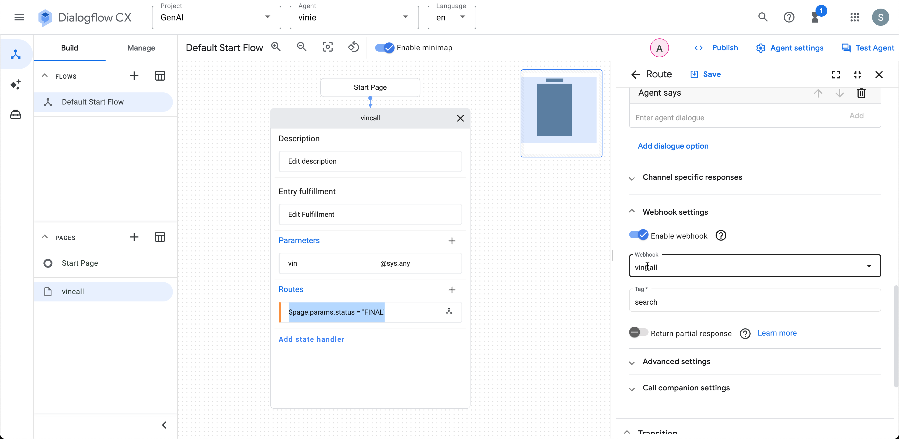

### Run fontend
```bash 
#update your agent-id in index.html
cd front-end
pip install requirments.txt
flask --app app  --debug run 
```
### Run Cloud Functions
```bash
# update your project id in index.js
cd cloud-function 
npm install
npm start
```
### Dialogflow setup

